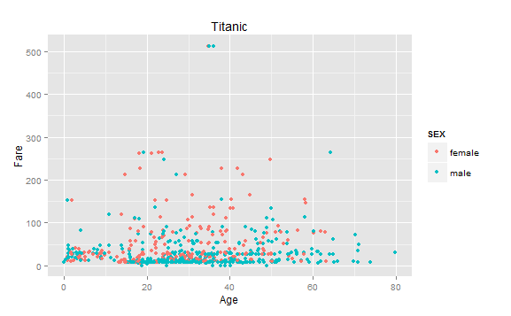
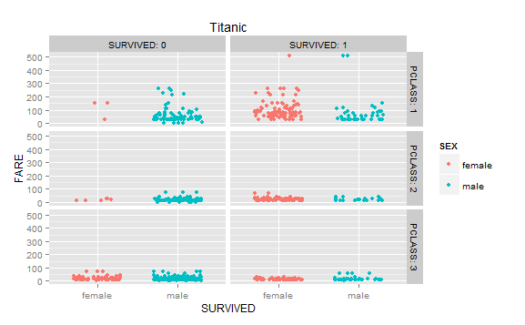

To retrieve the data from the database:
```{r}
source("../01 Data/TitanicData.R", echo = FALSE)
```

Print out a summary of the Titanic database:
```{r}
summary(df)
```

Head of the dataframe:
```{r}
head(df)
```
  
 

###First plot: 
This plot shows the relationship between the fare paid for each ticket and the age of the person whos purchased said ticket. Additionally, the data points are partitioned by color (green or pink) to distinguish whether the purchaser was male or female. The data shows a heavy density of tickets purchases where $0 <= the cost of the ticket <= $100. Within this set, there is also a dense population of data that pertains to 20 yrs old <= the age of the passanger <= 40 yrs old. Therefore, we can conclude that the majority of 20-40 year olds purchased tickets that were less than or equal to $100.

###Second plot:  


The second plot shows a similar relationship between Fare and Age, with the exception that the sex of the passenger was only recorded as a data point if it was male or female. This model removes the "null" set of sex data points. 

###Third plot:  


The third plot shows that there lies a clear discrepancy between the amount of fare paid and number of casualties. That is, the lower the cost of fare implies the lower percentage chance of surviving the catastrophe. In addition, the passenger data set is partitioned into two subsets: male or female. From this data, we notice that a dense population of femlaes survived regardless of the amount of their fare purchase. Also, we see that despite paying a higher fare, many males did not survive as well. Thus, we can conclude, with the exception of a few outliers, that the procedure stood firm to allow women to escape the boat before men were allowed.

###Fourth plot:  


###Fifth plot:  

