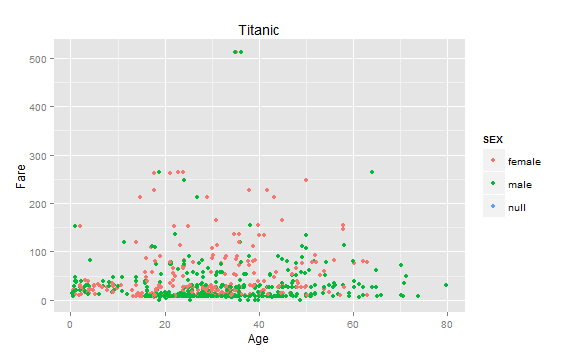
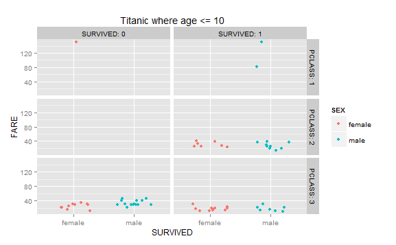

To retrieve the data from the database:
```{r}
source("../01 Data/TitanicData.R", echo = FALSE)
```

Print out a summary of the Titanic database:
```{r}
summary(df)
```

Head of the dataframe:
```{r}
head(df)
```

### First plot:

```
require("jsonlite")
require("RCurl")
# Change the USER and PASS below to be your UTEid
df <- data.frame(fromJSON(getURL(URLencode('129.152.144.84:5001/rest/native/?query="select * from titanic"'),httpheader=c(DB='jdbc:oracle:thin:@129.152.144.84:1521/PDBF15DV.usuniversi01134.oraclecloud.internal', USER='cs329e_hys82', PASS='orcl_hys82', MODE='native_mode', MODEL='model', returnDimensions = 'False', returnFor = 'JSON'), verbose = TRUE), ))

require(extrafont)
ggplot() + 
  coord_cartesian() + 
  scale_x_continuous() +
  scale_y_continuous() +
  #facet_wrap(~SURVIVED) +
  #facet_grid(.~SURVIVED, labeller=label_both) + # Same as facet_wrap but with a label.
  #facet_grid(PCLASS~SURVIVED, labeller=label_both) +
  labs(title='Titanic') +
  labs(x="Age", y=paste("Fare")) +
  layer(data=df, 
        mapping=aes(x=as.numeric(as.character(AGE)), y=as.numeric(as.character(FARE)), color=SEX), 
        stat="identity", 
        stat_params=list(), 
        geom="point",
        geom_params=list(), 
        #position=position_identity()
        position=position_jitter(width=0.3, height=0)
  )
```
   
This plot shows the relationship between the fare paid for each ticket and the age of the person who purchased said ticket. Additionally, the data points are partitioned by color (green or pink) to distinguish whether the purchaser was male, female, or null. The data shows a heavy density of tickets purchases where $0 <= the cost of the ticket <= $100. Within this set, there is also a dense population of data that pertains to 20 yrs <= the age of the passanger <= 40 yrs. Therefore, we can conclude that the majority of 20-40 year olds purchased tickets that were less than or equal to $100.

### Second plot: 
```
require("jsonlite")
require("RCurl")
require("ggplot2")
# Change the USER and PASS below to be your UTEid
df <- data.frame(fromJSON(getURL(URLencode('129.152.144.84:5001/rest/native/?query="select * from titanic where sex is not null"'),httpheader=c(DB='jdbc:oracle:thin:@129.152.144.84:1521/PDBF15DV.usuniversi01134.oraclecloud.internal', USER='cs329e_hys82', PASS='orcl_hys82', MODE='native_mode', MODEL='model', returnDimensions = 'False', returnFor = 'JSON'), verbose = TRUE), ))

require(extrafont)
ggplot() + 
  coord_cartesian() + 
  scale_x_continuous() +
  scale_y_continuous() +
  #facet_wrap(~SURVIVED) +
  #facet_grid(.~SURVIVED, labeller=label_both) + # Same as facet_wrap but with a label.
  #facet_grid(PCLASS~SURVIVED, labeller=label_both) +
  labs(title='Titanic') +
  labs(x="Age", y=paste("Fare")) +
  layer(data=df, 
        mapping=aes(x=as.numeric(as.character(AGE)), y=as.numeric(as.character(FARE)), color=SEX), 
        stat="identity", 
        stat_params=list(), 
        geom="point",
        geom_params=list(), 
        #position=position_identity()
        position=position_jitter(width=0.3, height=0)
  )
```
  
The second plot shows a similar relationship between Fare and Age, with the exception that the sex of the passenger was only recorded as a data point if it was male or female. This model removes the "null" set of sex data points. 

### Third plot: 
```
require("jsonlite")
require("RCurl")

# Change the USER and PASS below to be your UTEid
df <- data.frame(fromJSON(getURL(URLencode('129.152.144.84:5001/rest/native/?query="select * from titanic where survived=0 or survived=1"'),httpheader=c(DB='jdbc:oracle:thin:@129.152.144.84:1521/PDBF15DV.usuniversi01134.oraclecloud.internal', USER='cs329e_hys82', PASS='orcl_hys82', MODE='native_mode', MODEL='model', returnDimensions = 'False', returnFor = 'JSON'), verbose = TRUE)))

require("ggplot2")
require("extrafont")

ggplot() + 
  coord_cartesian() + 
  scale_x_discrete() +
  scale_y_continuous() +
  #facet_grid(PCLASS~SURVIVED, labeller=label_both) +
  labs(title='Titanic') +
  labs(x="SURVIVED", y=paste("FARE")) +
  layer(data=df, 
        mapping=aes(x=SEX, y=as.numeric(as.character(FARE)), color=as.character(SURVIVED)), 
        stat="identity", 
        stat_params=list(), 
        geom="point",
        geom_params=list(), 
        #position=position_identity()
        position=position_jitter(width=0.3, height=0)
  )
```
  
The third plot shows that there lies a clear discrepancy between the amount of fare paid and number of casualties. That is, the lower the cost of fare implies the lower percentage chance of surviving the catastrophe. In addition, the passenger data set is partitioned into two subsets: male or female. From this data, we notice that a dense population of femlaes survived regardless of the amount of their fare purchase. Also, we see that despite paying a higher fare, many males did not survive as well. Thus, we can conclude, with the exception of a few outliers, that the procedure stood firm to allow women to escape the boat before men were allowed.

### Fourth plot: 
```
require("jsonlite")
require("RCurl")

# Change the USER and PASS below to be your UTEid
df <- data.frame(fromJSON(getURL(URLencode('129.152.144.84:5001/rest/native/?query="select * from titanic where survived=0 or survived=1"'),httpheader=c(DB='jdbc:oracle:thin:@129.152.144.84:1521/PDBF15DV.usuniversi01134.oraclecloud.internal', USER='cs329e_hys82', PASS='orcl_hys82', MODE='native_mode', MODEL='model', returnDimensions = 'False', returnFor = 'JSON'), verbose = TRUE)))

require("ggplot2")
require("extrafont")

ggplot() + 
  coord_cartesian() + 
  scale_x_discrete() +
  scale_y_continuous() +
  facet_grid(PCLASS~SURVIVED, labeller=label_both) +
  labs(title='Titanic') +
  labs(x="SURVIVED", y=paste("FARE")) +
  layer(data=df, 
        mapping=aes(x=SEX, y=as.numeric(as.character(FARE)), color=SEX), 
        stat="identity", 
        stat_params=list(), 
        geom="point",
        geom_params=list(), 
        #position=position_identity()
        position=position_jitter(width=0.3, height=0)
  )
```
  
This plot displays the sex of the passenger, whether they survived, the fare they paid, and what class they were in. The data suggests that, in the first class, most females survived while more than half of the males did not survive. In the second class, again most females survived, while the majorty of males did not. In the third class, it seems that over half of the males and females did not survive.

### Fifth plot:  
```
require("jsonlite")
require("RCurl")

# Change the USER and PASS below to be your UTEid
df <- data.frame(fromJSON(getURL(URLencode('129.152.144.84:5001/rest/native/?query="select * from titanic where age<=10 and (survived=0 or survived=1)"'),httpheader=c(DB='jdbc:oracle:thin:@129.152.144.84:1521/PDBF15DV.usuniversi01134.oraclecloud.internal', USER='cs329e_hys82', PASS='orcl_hys82', MODE='native_mode', MODEL='model', returnDimensions = 'False', returnFor = 'JSON'), verbose = TRUE)))

require("ggplot2")
require("extrafont")

ggplot() + 
  coord_cartesian() + 
  scale_x_discrete() +
  scale_y_continuous() +
  facet_grid(PCLASS~SURVIVED, labeller=label_both) +
  labs(title='Titanic where age <= 10') +
  labs(x="SURVIVED", y=paste("FARE")) +
  layer(data=df, 
        mapping=aes(x=SEX, y=as.numeric(as.character(FARE)), color=SEX), 
        stat="identity", 
        stat_params=list(), 
        geom="point",
        geom_params=list(), 
        #position=position_identity()
        position=position_jitter(width=0.3, height=0)
  )
```
  
This plot shows only ages that are <= 10, and it plots the fare versus the sex, and whether they survived. It is also split up into the different classes of the ship. The data suggests that more children in the second and first class survived, and in the third class there was about a 50-50 chance of survival. Only one female child in the first class that paid a high fare did not survive.  

### Sixth plot:
```
require("jsonlite")
require("RCurl")

# Change the USER and PASS below to be your UTEid
df <- data.frame(fromJSON(getURL(URLencode('129.152.144.84:5001/rest/native/?query="select * from titanic where age<=10 and (survived=0 or survived=1)"'),httpheader=c(DB='jdbc:oracle:thin:@129.152.144.84:1521/PDBF15DV.usuniversi01134.oraclecloud.internal', USER='cs329e_hys82', PASS='orcl_hys82', MODE='native_mode', MODEL='model', returnDimensions = 'False', returnFor = 'JSON'), verbose = TRUE)))

require("ggplot2")
require("extrafont")

ggplot() + 
  coord_cartesian() + 
  scale_x_discrete() +
  scale_y_continuous() +
  facet_grid(PCLASS~SURVIVED, labeller=label_both) +
  labs(title='Titanic where age <= 10') +
  labs(x="SURVIVED", y=paste("FARE")) +
  layer(data=df, 
        mapping=aes(x=SEX, y=as.numeric(as.character(FARE)), color=SEX), 
        stat="identity", 
        stat_params=list(), 
        geom="point",
        geom_params=list(), 
        #position=position_identity()
        position=position_jitter(width=0.3, height=0)
  )
```


In Plot 6 we notice that the previous plot trends of women who paid higher fare, and of a more distinguished class, have the highest density of survival data points. Plot 6 also shows that passengers who embarked from 'Q' or Queenstown, had the fewest passengers onboard the Titanic. Curious, our team did minimal outside research that resulted in the revelatation that Queenstown was the last stop to the Titanic made before its voyage. We hypothesize that the low number of passengers from 'Q' was largely determined because it was the last stop and there may not have been many cbins left. Additionally, Plot 6 confirms that many more women survived than men, regardless of fare or class. Thus following the "women and children first" survival procedure. 
