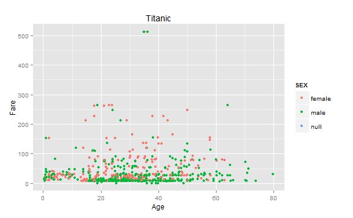
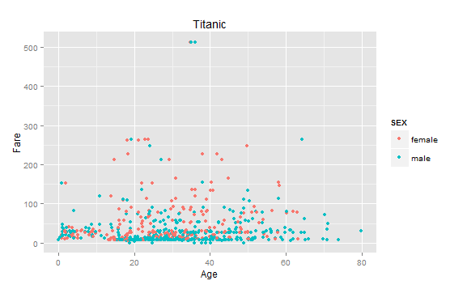
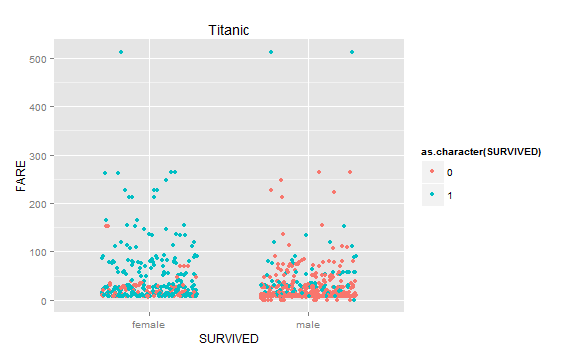
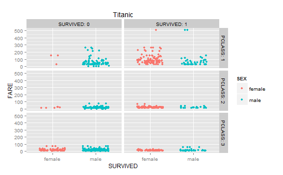
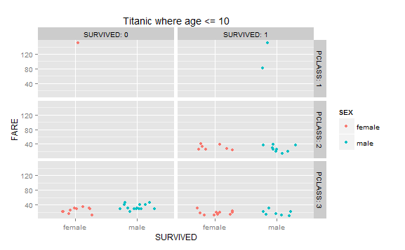

To retrieve the data from the database:
```{r}
source("../01 Data/TitanicData.R", echo = FALSE)
```

Print out a summary of the Titanic database:
```{r}
summary(df)
```

First plot:
 

Second plot:


Third plot:


Fourth plot:


Fifth plot

